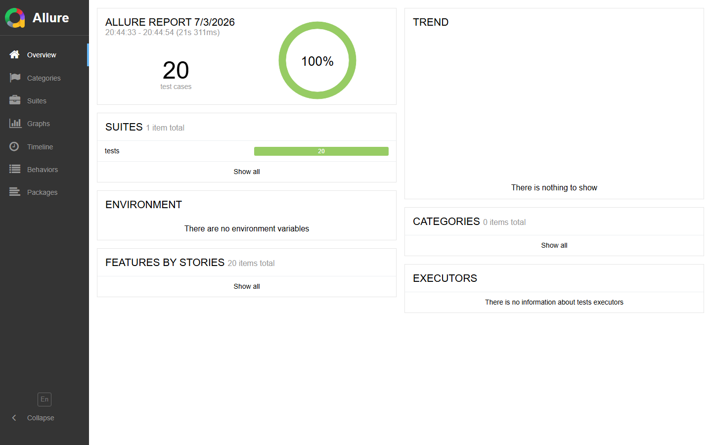

# Playwright SauceDemo — Suite de Tests E2E

[](https://github.com/boris7481/playwright-saucedemo-regression-suite-claude-code/actions/workflows/tests.yml)


[](LICENSE)

## Présentation du projet

Ce dépôt contient une suite de tests end-to-end pour le site de démonstration [SauceDemo](https://www.saucedemo.com/), construite avec **Playwright (Python)** et **pytest**. Le framework suit une architecture **Page Object Model** complète, avec des données de test centralisées, une intégration continue via **GitHub Actions**, et des rapports de test via **Allure**.

Le projet a été développé de façon incrémentale sur 12 sprints, chacun validé par un diff explicite et un commit dédié (voir [Historique des sprints](#historique-des-sprints)).

## Objectifs

- Démontrer une architecture de test E2E professionnelle, lisible et maintenable par une équipe QA.
- Illustrer les bonnes pratiques Playwright/pytest : Page Object Model, fixtures, paramétrisation ciblée, reporting, CI/CD.
- Servir de référence technique pour l'automatisation de tests.

## Technologies utilisées

| Outil | Rôle |
|---|---|
| Python 3.13 | Langage |
| [Playwright](https://playwright.dev/python/) | Pilotage navigateur |
| [pytest](https://docs.pytest.org/) | Framework de test |
| pytest-playwright | Intégration Playwright / pytest |
| pytest-base-url | Gestion de la `base_url` |
| pytest-xdist | Exécution parallèle |
| [allure-pytest](https://allurereport.org/) | Génération des résultats de test structurés |
| GitHub Actions | Intégration continue |
| Faker | Génération de données (disponible) |

## Architecture du projet

```
tests/  ──utilise──▶  fixtures (conftest.py)  ──instancie──▶  Page Objects  ──pilote──▶  Playwright
                                                                     │
test_data/  ◀──utilisé par les tests et les Page Objects────────────┘
```

Principes structurants :
- **Aucune assertion dans les Page Objects** — ils exposent des actions (`login()`, `add_to_cart()`) et des lectures d'état (`get_product_prices()`), jamais de vérifications. Les assertions restent dans les tests.
- **Aucune chaîne codée en dur** dans les tests — toutes les données (identifiants, produits, messages) viennent de `test_data/`.
- **Page Objects injectés via fixtures pytest**, jamais instanciés manuellement dans un test.

## Arborescence expliquée

```
playwright-saucedemo-regression-suite_bis/
├── .github/workflows/tests.yml   # Pipeline CI : exécution des tests sur push/PR vers main
├── docs/screenshots/                # Capture du rapport Allure
├── pages/
│   ├── base_page.py                 # Comportements communs (navigation, menu, logout)
│   ├── login_page.py                 # Page Object : connexion
│   ├── inventory_page.py              # Page Object : catalogue produits
│   ├── cart_page.py                    # Page Object : panier
│   └── checkout_page.py                 # Page Object : tunnel de commande
├── test_data/
│   ├── users.py                    # Identifiants de test
│   ├── products.py                  # Catalogue produits, prix, options de tri
│   ├── checkout_info.py              # Données du formulaire de commande
│   └── messages.py                    # Messages d'erreur / succès métier
├── tests/
│   ├── test_login.py                # Scénarios de connexion
│   ├── test_inventory.py             # Catalogue, tri
│   ├── test_card.py                   # Panier
│   ├── test_checkout.py                # Tunnel de commande
│   ├── test_e2e_order.py                # Parcours complet bout-en-bout
│   └── test_logout.py                    # Déconnexion
├── conftest.py                     # Fixtures pytest (authentification, Page Objects)
├── pytest.ini                      # Configuration pytest (base_url, --headed)
├── requirements.txt                # Dépendances Python figées
├── .editorconfig                   # Conventions d'édition
├── .gitignore
├── LICENSE                         # Licence MIT
└── README.md
```

## Installation

### Prérequis
- Python 3.13+
- Git

### Création de l'environnement virtuel
```bash
python -m venv .venv
```
Activation :
```bash
# Windows (PowerShell)
.venv\Scripts\Activate.ps1

# macOS / Linux
source .venv/bin/activate
```

### Installation des dépendances
```bash
pip install -r requirements.txt
```

### Installation des navigateurs Playwright
```bash
playwright install chromium
```
> En CI (Linux), le flag `--with-deps` installe aussi les bibliothèques système requises : `playwright install --with-deps chromium` (déjà configuré dans le workflow GitHub Actions).

## Exécution des tests

Lancer toute la suite (mode `--headed` par défaut, voir `pytest.ini`) :
```bash
pytest
```

### Exécution d'un fichier de test
```bash
pytest tests/test_checkout.py
```

### Exécution d'un test unique
```bash
pytest tests/test_checkout.py::test_checkout_complete
```

### Tests paramétrés
```bash
# Tous les cas d'un test paramétré
pytest tests/test_checkout.py::test_checkout_required_field

# Un seul cas précis, via son id
pytest "tests/test_checkout.py::test_checkout_required_field[missing_first_name]"

# Filtrage par mot-clé
pytest -k "missing_first_name"
```

## Génération des rapports Allure

L'intégration Allure est **volontaire** (pas activée par défaut dans `pytest.ini`, pour garder `pytest` neutre en local) :
```bash
# 1. Exécuter les tests en générant les résultats bruts
pytest --alluredir=reports/allure-results

# 2. Consulter le rapport (nécessite l'outil allure, installation séparée hors pip)
allure serve reports/allure-results

# — ou générer un rapport HTML statique —
allure generate reports/allure-results -o reports/allure-report --clean
```
> L'outil `allure` (CLI Java) s'installe séparément de `allure-pytest` : par exemple `scoop install allure` (Windows), `brew install allure` (macOS).

## Lancement du pipeline GitHub Actions

Le workflow `.github/workflows/tests.yml` se déclenche automatiquement sur chaque `push` ou `pull_request` vers `main`. Il peut aussi être lancé manuellement depuis l'onglet **Actions** du dépôt → **Tests E2E** → **Run workflow**. Le badge en haut de ce README reflète l'état du dernier run.

Le pipeline exécute les tests sur `ubuntu-latest` via `xvfb-run` (pour préserver le mode `--headed` sans modifier `pytest.ini`), génère les résultats Allure et capture les échecs en screenshot, puis publie deux artefacts téléchargeables depuis la page du run : `allure-results` et `playwright-screenshots`.

## Structure des Page Objects

| Page Object | Fichier | Responsabilité |
|---|---|---|
| `BasePage` | `pages/base_page.py` | Comportements transverses : navigation, menu, logout |
| `LoginPage` | `pages/login_page.py` | Formulaire de connexion |
| `InventoryPage` | `pages/inventory_page.py` | Catalogue produits, tri, ajout au panier |
| `CartPage` | `pages/cart_page.py` | Contenu du panier, suppression, navigation vers checkout |
| `CheckoutPage` | `pages/checkout_page.py` | Tunnel de commande (informations, récapitulatif, confirmation) |

## Structure des données de test

| Fichier | Contenu |
|---|---|
| `test_data/users.py` | Identifiants (utilisateur standard, verrouillé, invalide...) |
| `test_data/products.py` | Noms de produits, prix, options de tri |
| `test_data/checkout_info.py` | Jeux de données du formulaire de commande |
| `test_data/messages.py` | Messages d'erreur / succès métier attendus |

Choix assumé : des dictionnaires simples plutôt que des `dataclass`, pour rester lisible et prêt à être réutilisé directement dans `pytest.mark.parametrize`.

## Fixtures utilisées

| Fixture | Portée | Rôle |
|---|---|---|
| `page` | function (pytest-playwright) | Page Playwright brute, non authentifiée |
| `authenticated_page` | function | Page connectée avec l'utilisateur standard |
| `login_page` | function | Instance de `LoginPage` liée à `page` |
| `inventory_page` | function | Instance de `InventoryPage` liée à `authenticated_page` |
| `cart_page` | function | Instance de `CartPage` liée à `authenticated_page` |
| `checkout_page` | function | Instance de `CheckoutPage` liée à `authenticated_page` |

## Bonnes pratiques du framework

- Aucune chaîne codée en dur : toutes les données proviennent de `test_data/`.
- Aucune assertion dans les Page Objects — séparation stricte action / vérification.
- Page Objects injectés via fixtures, jamais instanciés manuellement dans un test.
- `pytest.mark.parametrize` utilisé uniquement quand plusieurs tests partagent exactement le même comportement — pas de paramétrisation forcée.
- Reporting et CI strictement opt-in (`--alluredir`, `--screenshot`) : le comportement local par défaut de `pytest` n'a jamais été modifié.
- Chaque évolution du framework a été validée par un diff explicite avant application.

## Captures

### Rapport Allure


## Historique des sprints

| Sprint | Contenu |
|---|---|
| 1-5 | Mise en place du Page Object Model complet (`BasePage`, `LoginPage`, `InventoryPage`, `CartPage`, `CheckoutPage`) |
| 6 | Centralisation des données de test (`test_data/`) |
| 7 | Fixtures pytest pour l'injection des Page Objects |
| 8 | Paramétrisation ciblée avec `pytest.mark.parametrize` |
| 9 | Étude de Playwright Storage State (reportée) |
| 10 | Intégration d'Allure Reports |
| 11 | Pipeline GitHub Actions (CI) |
| 12 | Documentation et professionnalisation du dépôt |

## Auteur

**Auteur :** Boris Thibaut Tondjua
**GitHub :** [@boris7481](https://github.com/boris7481)

## Perspectives d'évolution

- Playwright Storage State pour éviter le login UI répété (reporté au Sprint 9, prêt à être implémenté).
- Publication automatique du rapport Allure avec historique de tendances entre runs CI.
- Exécution multi-navigateurs (Firefox, WebKit) en complément de Chromium.
- Ajout d'un outil de lint/format (ruff, black) avec un workflow CI dédié.
- Environnements configurables (staging/prod) via variable d'environnement pour `base_url`.

## Licence

Ce projet est distribué sous licence MIT — voir le fichier [LICENSE](LICENSE).
